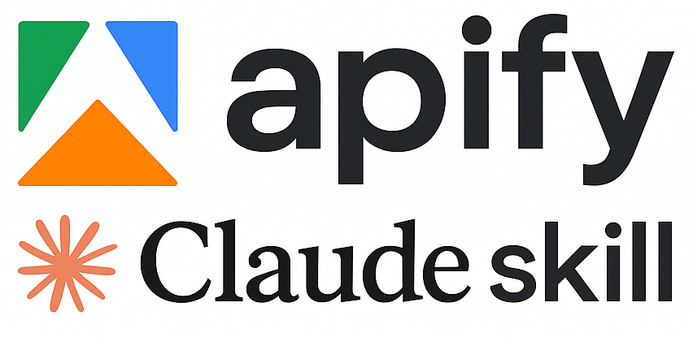

<div align="center">
  
</div>

A comprehensive skill for Claude Code that enables creating, developing, modifying, debugging, and deploying Apify actors for web scraping and automation.

## What This Skill Does

This skill provides Claude Code with deep knowledge and templates for building Apify actors, including:

- Creating new actors from templates
- Implementing web scraping logic with Python
- Configuring input/output schemas
- Writing marketplace documentation
- Debugging and deploying actors
- Implementing standby mode for real-time APIs
- Best practices for performance and security

## Prerequisites

Before using this skill, you need:

1. **Claude Account** - Sign up at [claude.ai](https://claude.ai)
2. **Apify CLI** (optional but recommended) - The skill can guide Claude to install this:
   ```bash
   brew install apify-cli  # macOS
   # or: npm install -g apify-cli
   ```
3. **Apify Account** - Sign up at [apify.com](https://www.apify.com?fpr=dx0tf8)

## Installation

### Method 1: Local Claude Code

1. Create the skills directory (if it doesn't exist):
   ```bash
   mkdir -p ~/.claude/skills
   ```

2. Clone this repository:
   ```bash
   git clone https://github.com/tducret/apify-actor-skill.git ~/github/apify-actor-skill
   ```

3. Create a symbolic link to the skill:
   ```bash
   ln -s ~/github/apify-actor-skill/apify-actor ~/.claude/skills/apify-actor
   ```

4. Restart Claude Code CLI to load the skill

The skill will now be available in your Claude Code CLI sessions and will activate automatically when working with Apify-related tasks.

### Method 2: Claude Code in the Cloud

1. (if you want to create an Apify actor from scratch) Create a repo on Github with just the `LICENSE` file (to initialize the `main` branch).

2. Go to [Claude Code](https://claude.ai/code/) and select your Github repo.

3. Add a new environment with:
   - **Complete** network access (adapt depending on the project sensitivity)
   - Environment variable: `APIFY_TOKEN=[ADD_YOURS]` (create a new token dedicated to Claude Code in [Apify Settings](https://console.apify.com/settings/integrations))

3. Define the first prompt like so:

```txt
In this session, we will create an Apify actor that does [INSERT YOUR QUICK DESCRIPTION].

Before that, let's install "apify-actor" skill.
To do that, get the zipped skill in the latest release https://github.com/tducret/apify-actor-skill.
Unzip it in /root/.claude/skills and ensure it is successfully loaded.

Finally, ensure the skill dependencies are installed and configured.
Check `apify info` command is successful (or try to login).
```

## How to Use

Once installed, the skill activates automatically when you ask Claude about Apify-related tasks:

### Creating a New Actor

```
Create an Apify actor that can [INSERT YOUR DESCRIPTION].

Inputs:
- [LIST YOUR INPUTS]

Outputs:
- [LIST YOUR OUTPUTS]

Ask me if something needs clarification.
```

### Deploying Actors

```
Deploy my actor to Apify platform
```

Claude will:
- Test locally first with `apify run`
- Push to platform with `apify push`
- Guide you through platform configuration

## Project Structure

```
apify-actor-skill/
├── apify-actor/              # The skill package
│   ├── SKILL.md              # Main skill documentation
│   ├── assets/               # Templates and resources
│   │   └── python-template/  # Minimal Python actor template
│   └── references/           # Detailed documentation
│       ├── python-sdk.md     # SDK patterns and examples
│       ├── standby-mode.md   # Real-time API implementation
│       ├── input-schema.md   # Input configuration
│       └── output-schema.md  # Output configuration
├── .claude/
│   └── settings.local.json   # Permissions configuration
└── README.md                 # This file
```

## Automated Releases

This repository includes a GitHub Action that automatically packages the skill:

- **On tag push**: Creates a GitHub release with the packaged `apify-actor.zip`
- **Manual trigger**: Can be run manually from the Actions tab
- **Artifact upload**: Non-tagged builds upload the zip as an artifact

To create a new release:
```bash
git tag -a v1.0.0 -m "Release version 1.0.0"
git push origin v1.0.0
```

## Features

### Templates

The skill includes a minimal Python actor template in `assets/python-template/` with:
- Basic project structure
- Input/output schema examples
- Docker configuration
- Pre-commit hooks setup
- Comprehensive ACTOR.md documentation template

### Reference Documentation

Detailed guides in `references/`:
- **python-sdk.md** - Complete SDK examples (HTTP scraping, browser automation, crawling)
- **standby-mode.md** - Real-time API patterns for instant responses
- **input-schema.md** - Input validation and UI configuration
- **output-schema.md** - Output configuration and data access templates

### Best Practices

The skill guides Claude to follow Apify best practices:
- Input validation with clear error messages
- Structured logging for debugging
- Batch processing for performance
- Proxy usage for reliability
- Security (no hardcoded secrets, non-root execution)
- Comprehensive marketplace documentation

## Examples

### Example 1: Simple HTTP Scraper

```
Create an actor that scrapes article titles and links from a news website
```

Claude will create a complete actor with:
- BeautifulSoup-based scraping
- Configurable URL input
- Structured output to dataset
- Error handling and logging

### Example 2: Browser Automation

```
Build an actor that takes screenshots of websites using Playwright
```

Claude will:
- Set up Playwright with Python
- Configure browser options
- Implement screenshot capture
- Save to key-value store
- Add proxy support

### Example 3: Standby Mode API

```
Convert my scraper to standby mode for real-time API access
```

Claude will:
- Implement persistent HTTP server
- Add API endpoints
- Configure standby settings
- Provide usage examples
- Optimize for low latency

## Troubleshooting

### Skill Not Activating

If Claude doesn't recognize Apify commands:
- Verify the skill is installed (Settings > Skills)
- Try mentioning "Apify" explicitly in your request
- Check that `SKILL.md` has the correct trigger keywords

### Permission Errors

If you get permission errors:
- Check `.claude/settings.local.json`
- Add required permissions to the "allow" list
- Restart Claude Code

### CLI Not Found

If `apify` command is not found:
- Install Apify CLI: `brew install apify-cli`
- Or ask Claude: "Install the Apify CLI"
- Verify installation: `apify --version`

## Contributing

To contribute improvements:

1. Fork this repository
2. Make your changes to `apify-actor/SKILL.md` or reference docs
3. Test with Claude Code
4. Submit a pull request

## Documentation Updates

The skill references official Apify documentation at `https://docs.apify.com/llms.txt` for the latest information. If you need features not covered by the skill, Claude can fetch current docs automatically.

## License

MIT License - See LICENSE file for details

## Resources

- [Apify Documentation](https://docs.apify.com)
- [Apify Python SDK](https://docs.apify.com/sdk/python)
- [Claude Code Documentation](https://code.claude.com/docs)
- [Skill Creator Guide](https://code.claude.com/docs/skills)

## Support

For issues with:
- **This skill**: Open an issue in this repository
- **Claude Code**: Visit [code.claude.com/support](https://code.claude.com/support)
- **Apify platform**: Visit [help.apify.com](https://help.apify.com)
